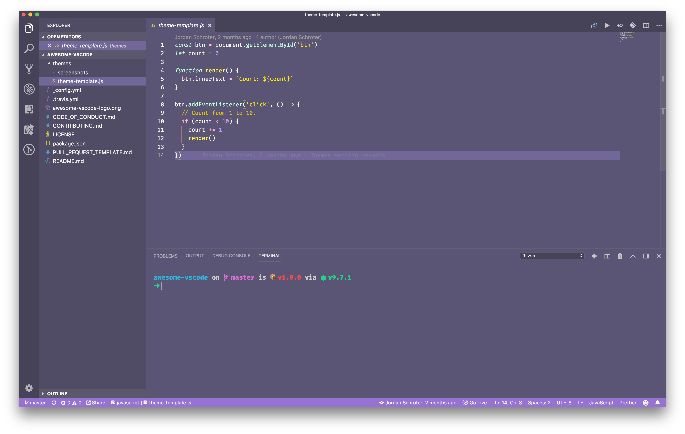

<br/>
<div align="center">
  
</div>
<br/>
<div align="center">

A curated list of delightful [Visual Studio Code](https://code.visualstudio.com/) packages and resources. For more awesomeness, check out [awesome](https://github.com/sindresorhus/awesome).

[](https://github.com/sindresorhus/awesome) [](https://travis-ci.org/viatsko/awesome-vscode)
</div>
<br/>

# Table of Contents

- [Official](#official)
- [Syntax](#syntax)
- [Migrating from other editors](#migrating-from-other-editors)
  - [Migrating from Vim](#migrating-from-vim)
  - [Migrating from Atom](#migrating-from-atom)
  - [Migrating from Sublime Text](#migrating-from-sublime-text)
  - [Migrating from Visual Studio](#migrating-from-visual-studio)
  - [Migrating from Intellij IDEA](#migrating-from-intellij-idea)
- [Lint and IntelliSense](#lint-and-intellisense)
  - [1C](#1c)
  - [Bash](#bash)
  - [C++](#c)
  - [C#](#c)
  - [CSS](#css)
  - [Go](#go)
  - [Haskell](#haskell)
  - [Shell](#shell)
  - [Java](#java)
  - [JavaScript](#javascript)
  - [Typescript](#typescript)
  - [Markdown](#markdown)
  - [PHP](#php)
    - [IntelliSense](#intellisense)
    - [Laravel](#laravel)
    - [Twig](#twig)
    - [Other extensions](#other-extensions)
    - [Read more](#read-more)
  - [Python](#python)
  - [ReasonML](#reasonml)
  - [Rust](#rust)
  - [Terraform](#terraform)
- [Productivity](#productivity)
  - [Azure Cosmos DB](#azure-cosmos-db)
  - [Azure IoT Toolkit](#azure-iot-toolkit)
  - [Bookmarks](#bookmarks)
  - [Create tests](#create-tests)
  - [Deploy](#deploy)
  - [Duplicate Action](#duplicate-action)
  - [ES7 React/Redux/GraphQL/React-Native snippets](#es7-reactreduxgraphqlreact-native-snippets)
  - [Gi](#gi)
  - [Git History](#git-history)
  - [Git Project Manager](#git-project-manager)
  - [GitLink](#gitlink)
  - [GitLens](#gitlens)
  - [Git Indicators](#git-indicators)
  - [GitHub](#github)
  - [GitHub Pull Request Monitor](#github-pull-request-monitor)
  - [Icon Fonts](#icon-fonts)
  - [JS Parameter Annotations](#js-parameter-annotations)
  - [Kanban](#kanban)
  - [Live Server](#live-server)
  - [Multiple clipboards](#multiple-clipboards)
  - [Dotnet Core Test Explorer](#dotnet-core-test-explorer)
  - [npm Intellisense](#npm-intellisense)
  - [Partial Diff](#partial-diff)
  - [Paste JSON as Code](#paste-json-as-code)
  - [Path IntelliSense](#path-intellisense)
  - [Project Manager](#project-manager)
  - [REST Client](#rest-client)
  - [Settings Sync](#settings-sync)
  - [Todo Tree](#todo-tree)
  - [Toggle Quotes](#toggle-quotes)
  - [Yo](#yo)
- [Formatting/Beautification](#formatting--beautification)
  - [Better Align](#better-align)
  - [Auto Close Tag](#auto-close-tag)
  - [Auto Rename Tag](#auto-rename-tag)
  - [beautify](#beautify)
  - [html2pug](#html2pug)
  - [ECMAScript Quotes Transformer](#ecmascript-quotes-transformer)
  - [Paste and Indent](#paste-and-indent)
  - [Sort Lines](#sort-lines)
  - [Surround](#surround)
  - [Wrap Selection](#wrap-selection)
  - [Formatting Toggle](#formatting-toggle)
  - [Bracket Pair Colorizer](#bracket-pair-colorizer)
  - [Auto Import](#auto-import)
- [Explorer Icons](#explorer-icons)
  - [City Lights Icons](#city-lights-icons)
  - [VSCode Icons](#vscode-icons)
  - [Seti-UI](#seti-icons)
  - [Material-Icon-Theme](#material-icon-theme)
- [Uncategorized](#uncategorized)
  - [Carbon-now-sh](#carbon-now-sh)
  - [Code Runner](#code-runner)
  - [Color Highlight](#color-highlight)
  - [Output Colorizer](#output-colorizer)
  - [Dash](#dash)
  - [Debugger for Chrome](#debugger-for-chrome)
  - [ECMAScript Quotes Transformer](#ecmascript-quotes-transformer)
  - [Edit with Shell Command](#edit-with-shell-command)
  - [Editor Config for VS Code](#editor-config-for-vs-code)
  - [ftp-sync](#ftp-sync)
  - [Highlight JSX/HTML tags](#highlight-jsxhtml-tags)
  - [PlatformIO](#platformio)
  - [Polacode](#polacode)
  - [Quokka](#quokka)
  - [Remote Workspace](#remote-workspace)
  - [Runner](#runner)
  - [Slack](#slack)
  - [Spotify](#spotify)
  - [SVG Viewer](#svg-viewer)
  - [Text Marker (Highlighter)](#text-marker-highlighter)
- [Themes](#themes)
  - [An Old Hope Theme by Dustin Sanders](#an-old-hope-theme-by-dustin-sanders)
  - [Ariake Dark by wart](#ariake-dark-by-wart)
  - [Atom One Dark Theme by Mahmoud Ali](#atom-one-dark-theme-by-mahmoud-ali)
  - [Ayu by teabyii](#ayu-by-teabyii)
  - [Captain Sweetheart by ultradracula](#captain-sweetheart-by-ultradracula)
  - [City Lights Theme by Yummygum](#city-lights-by-yummygum)
  - [Cobalt2 Theme Official by Wes Bos](#cobalt2-theme-official-by-wes-bos)
  - [Dracula Official by Dracula Theme](#dracula-official-by-dracula-theme)
  - [Edge by Bogdan Lazar](#edge-by-bogdan-lazar)
  - [Eva Theme by fisheva](#eva-theme-by-fisheva)
  - [Fairyfloss by nopjmp and sailorhg](#fairy-floss-by-nopjmp-and-sailorhg)
  - [GitHub Theme by Thomas Pink](#github-theme-by-thomas-pink)
  - [Material Palenight Theme by whizkydee](#material-palenight-theme-by-whizkydee)
  - [Material Theme by Mattia Astorino](#material-theme-by-mattia-astorino)
  - [Mno by u29dc](#mno-by-u29dc)
  - [Night Owl by Sarah Drasner](#night-owl-by-sarah-drasner)
  - [Plastic by Will Stone](#plastic-by-will-stone)
  - [Nord by arcticicestudio](#nord-by-arcticicestudio)
  - [Shades of Purple by Ahmad Awais](#shades-of-purple-by-ahmad-awais)
  - [Slime Theme by smlombardi](#slime-theme-by-smlombardi)
- [People to Follow](#people-to-follow)
- [Resources for extension developers](#resources-for-extension-developers)
  - [Documentation](#documentation)
  - [Libraries](#libraries)
  - [Tools](#tools)
- [Contribute](#contribute)
- [License](#license)

# Official

- [Official website](https://code.visualstudio.com/)
- [Source code](https://github.com/microsoft/vscode) on GitHub
- [Releases (stable channel)](https://code.visualstudio.com/download)
- [Releases (insiders channel)](https://code.visualstudio.com/insiders)
- [Monthly iteration plans](https://github.com/Microsoft/vscode/issues?utf8=%E2%9C%93&q=label%3Aiteration-plan+)

# Syntax

Language packages extend the editor with syntax highlighting and/or snippets for a specific language or file format.

- [Arduino](https://marketplace.visualstudio.com/items?itemName=vsciot-vscode.vscode-arduino)
- [Befunge](https://marketplace.visualstudio.com/items?itemName=kagof.befunge)
- [Blink](https://marketplace.visualstudio.com/items?itemName=melmass.blink)
- [Bolt](https://marketplace.visualstudio.com/items?itemName=smkamranqadri.vscode-bolt-language)
- [Bond](https://marketplace.visualstudio.com/items?itemName=vicey.vscode-bond)
- [CMake](https://marketplace.visualstudio.com/items?itemName=twxs.cmake)
- [Dart](https://marketplace.visualstudio.com/items?itemName=Dart-Code.dart-code)
- [Dockerfile](https://marketplace.visualstudio.com/items?itemName=PeterJausovec.vscode-docker)
- [EJS](https://marketplace.visualstudio.com/items?itemName=QassimFarid.ejs-language-support)
- [Elixir](https://marketplace.visualstudio.com/items?itemName=mjmcloug.vscode-elixir)
- [Elm](https://marketplace.visualstudio.com/items?itemName=sbrink.elm)
- [Erlang](https://marketplace.visualstudio.com/items?itemName=pgourlain.erlang)
- [F#](https://marketplace.visualstudio.com/items?itemName=Ionide.Ionide-fsharp)
- [Flatbuffers](https://marketplace.visualstudio.com/items?itemName=gaborv.flatbuffers)
- [Fortran](https://marketplace.visualstudio.com/items?itemName=Gimly81.fortran)
- [Hack(HHVM)](https://marketplace.visualstudio.com/items?itemName=pranayagarwal.vscode-hack)
- [Handlebars](https://marketplace.visualstudio.com/items?itemName=andrejunges.Handlebars)
- [Hive SQL](https://marketplace.visualstudio.com/items?itemName=josephtbradley.hive-sql)
- [KL](https://marketplace.visualstudio.com/items?itemName=melmass.kl)
- [Kotlin](https://marketplace.visualstudio.com/items?itemName=mathiasfrohlich.Kotlin)
- [LaTeX](https://marketplace.visualstudio.com/items?itemName=torn4dom4n.latex-support)
- [Mason](https://marketplace.visualstudio.com/items?itemName=viatsko.html-mason)
- [openHAB](https://marketplace.visualstudio.com/items?itemName=openhab.openhab)
- [Parser 3](https://marketplace.visualstudio.com/items?itemName=viatsko.parser3)
- [Pascal](https://marketplace.visualstudio.com/items?itemName=alefragnani.pascal), or [OmniPascal](https://marketplace.visualstudio.com/items?itemName=Wosi.omnipascal) (only for Windows)
- [Perl HTML-Template](https://marketplace.visualstudio.com/items?itemName=viatsko.perl-html-template)
- [Protobuf](https://marketplace.visualstudio.com/items?itemName=peterj.proto)
- [Ruby](https://marketplace.visualstudio.com/items?itemName=groksrc.ruby)
- [Scala](https://marketplace.visualstudio.com/items?itemName=itryapitsin.Scala)
- [Stylus](https://marketplace.visualstudio.com/items?itemName=sysoev.language-stylus)
- [Swift](https://marketplace.visualstudio.com/items?itemName=Kasik96.swift)
- [VEX](https://marketplace.visualstudio.com/items?itemName=melmass.vex)
- [Zephir](https://marketplace.visualstudio.com/items?itemName=zephir-lang.zephir)

# Migrating from other editors

The VSCode team provides keymaps from popular editors, making the transition to VSCode almost seamless and easy.

## [Migrating from Vim](https://marketplace.visualstudio.com/items?itemName=vscodevim.vim)

> **Vim Mode** - Relatively new, but promising extension implementing Vim features in VSCode. Authors suggest to join their [Slack channel](https://vscodevim-slackin.azurewebsites.net/) for feature requests on your favorite Vim features

## [Migrating from Atom](https://marketplace.visualstudio.com/items?itemName=ms-vscode.atom-keybindings)

> Popular Atom keybindings for Visual Studio Code

## [Migrating from Sublime Text](https://marketplace.visualstudio.com/items?itemName=ms-vscode.sublime-keybindings)

> Popular Sublime Text keybindings for VS Code.

## [Migrating from Visual Studio](https://marketplace.visualstudio.com/items?itemName=ms-vscode.vs-keybindings)

> Popular Visual Studio keybindings for VS Code.

## [Migrating from Intellij IDEA](https://marketplace.visualstudio.com/items?itemName=k--kato.intellij-idea-keybindings)

> Popular Intellij IDEA keybindings for VS Code.

# Lint and IntelliSense

In case the awesome nirvana that is linting has not yet been unleashed upon you:
> lint was the name originally given to a particular program that flagged some suspicious and non-portable constructs (likely to be bugs) in C language source code. The term is now applied generically to tools that flag suspicious usage in software written in any computer language.

Unlike some other editors, VS Code supports IntelliSense, linting, outline out-of-the-box and doesn't require any separate extension to run linter packages. Some linters are already integrated in VS Code, you can find the full list in the official documentation, [Languages](https://code.visualstudio.com/Docs/languages/overview) section.

## 1C

- [1C/OScript](https://marketplace.visualstudio.com/items?itemName=xDrivenDevelopment.language-1c-bsl) - rich 1С:Enterprise 8 (BSL) language support in VSC - add syntax highlighting to *.bsl и *.os files in VSC, add IntelliSense and syntax helper for 1С lang


## Bash

- [Bash IDE](https://marketplace.visualstudio.com/items?itemName=mads-hartmann.bash-ide-vscode)

## C++

- [C/C++](https://marketplace.visualstudio.com/items?itemName=ms-vscode.cpptools) - Preview C/C++ extension by [Microsoft](https://www.microsoft.com), read [official blog post](https://blogs.msdn.microsoft.com/vcblog/2016/03/31/cc-extension-for-visual-studio-code/) for the details
- [gnu-global-tags](https://marketplace.visualstudio.com/items?itemName=austin.code-gnu-global) - Provide Intellisense for C/C++ with the help of the GNU Global tool.
- [YouCompleteMe](https://marketplace.visualstudio.com/items?itemName=RichardHe.you-complete-me) - Provides semantic completions for C/C++ (and TypeScript, JavaScript, Objective-C, Golang, Rust) using [YouCompleteMe](http://valloric.github.io/YouCompleteMe/).
- [C/C++ Clang Command Adapter](https://github.com/mitaki28/vscode-clang) - Completion and Diagnostic for C/C++/Objective-C using Clang command.

## C\#

- [C#](https://marketplace.visualstudio.com/items?itemName=ms-vscode.csharp) - Preview C# extension by [Microsoft](https://www.microsoft.com), read [official documentation](https://code.visualstudio.com/docs/languages/csharp) for the details

- [C# FixFormat](https://marketplace.visualstudio.com/items?itemName=Leopotam.csharpfixformat) - Fix format of usings / indents / braces / empty lines

- [C# Extensions](https://marketplace.visualstudio.com/items?itemName=jchannon.csharpextensions) - Provides extensions to the IDE that will speed up your development workflow.


## CSS

### [CSS Peek](https://marketplace.visualstudio.com/items?itemName=pranaygp.vscode-css-peek)
> Peek or Jump to a CSS definition directly from HTML, just like in Brackets!


- [stylelint](https://marketplace.visualstudio.com/items?itemName=shinnn.stylelint) - Lint CSS/SCSS.
- [Autoprefixer](https://marketplace.visualstudio.com/items?itemName=mrmlnc.vscode-autoprefixer)
  Parse CSS,SCSS, LESS and add vendor prefixes automatically.
  

- [Intellisense for CSS class names](https://marketplace.visualstudio.com/items?itemName=Zignd.html-css-class-completion) - Provides CSS class name completion for the HTML class attribute based on the CSS files in your workspace. Also supports React's className attribute.

  

## Go

- [Go](https://marketplace.visualstudio.com/items?itemName=ms-vscode.Go) - Rich language support for the Go language.

## Haskell

- [haskell-linter](https://marketplace.visualstudio.com/items?itemName=hoovercj.haskell-linter)
## Shell

- [autocomplate-shell](https://marketplace.visualstudio.com/items?itemName=truman.autocomplate-shell)

## Java

- [Language Support for Java(TM) by Red Hat](https://marketplace.visualstudio.com/items?itemName=redhat.java)
- [Debugger for Java](https://marketplace.visualstudio.com/items?itemName=vscjava.vscode-java-debug)
  
- [Maven for Java](https://marketplace.visualstudio.com/items?itemName=vscjava.vscode-maven)

- [Lombok](https://marketplace.visualstudio.com/items?itemName=GabrielBB.vscode-lombok)

## JavaScript

- [Babel JavaScript](https://marketplace.visualstudio.com/items?itemName=mgmcdermott.vscode-language-babel)
- [Sublime Babel](https://marketplace.visualstudio.com/items?itemName=joshpeng.sublime-babel-vscode#overview) - Babel extension ported from Sublime Text

See the difference between these two [here](https://github.com/michaelgmcd/vscode-language-babel/issues/1)

- [tslint](https://marketplace.visualstudio.com/items?itemName=eg2.tslint) - TSLint for Visual Studio Code (with `"tslint.jsEnable": true`).
- [eslint](https://marketplace.visualstudio.com/items?itemName=dbaeumer.vscode-eslint) - Linter for [eslint](https://eslint.org/).
- [XO](https://marketplace.visualstudio.com/items?itemName=samverschueren.linter-xo) - Linter for [XO](https://github.com/xojs/xo).
- [AVA](https://marketplace.visualstudio.com/items?itemName=samverschueren.ava) - Snippets for [AVA](https://github.com/avajs/ava).
- [Prettier](https://marketplace.visualstudio.com/items?itemName=esbenp.prettier-vscode) - Linter, Formatter and Pretty printer for [Prettier](https://github.com/prettier/prettier-vscode).

### [Debugger for Chrome](https://marketplace.visualstudio.com/items?itemName=msjsdiag.debugger-for-chrome)

> A VS Code extension to debug your JavaScript code in the Chrome browser, or other targets that support the Chrome Debugging Protocol.


## TypeScript

- [tslint](https://marketplace.visualstudio.com/items?itemName=eg2.tslint) - TSLint for Visual Studio Code

## Markdown

- [markdownlint](https://marketplace.visualstudio.com/items?itemName=DavidAnson.vscode-markdownlint) - Linter for [markdownlint](https://github.com/DavidAnson/markdownlint).

## PHP

### IntelliSense

These extensions provide slightly different sets of features. While the first one offers better autocompletion support, the second one seems to have more features overall.

- [PHP Intelephense](https://marketplace.visualstudio.com/items?itemName=bmewburn.vscode-intelephense-client)
- [PHP IntelliSense](https://marketplace.visualstudio.com/items?itemName=felixfbecker.php-intellisense)

### Laravel

- [Laravel 5 Snippets](https://marketplace.visualstudio.com/items?itemName=onecentlin.laravel5-snippets) - Laravel 5 snippets for Visual Studio Code
- [Laravel Blade Snippets](https://marketplace.visualstudio.com/items?itemName=onecentlin.laravel-blade) - Laravel blade snippets and syntax highlight support


- [Laravel Model Snippets](https://marketplace.visualstudio.com/items?itemName=ahinkle.laravel-model-snippets) - Quickly get models up and running with Laravel Model Snippets.


- [Laravel Artisan](https://marketplace.visualstudio.com/items?itemName=ryannaddy.laravel-artisan) - Laravel Artisan commands within Visual Studio Code


- [DotENV](https://marketplace.visualstudio.com/items?itemName=mikestead.dotenv) - Support for dotenv file syntax


### Twig

- [Twig Language 2](https://marketplace.visualstudio.com/items?itemName=mblode.twig-language-2)

To enable Emmet support in .twig files, you'll need to have the following in your settings:

```json
{
  "emmet.includeLanguages": {
    "twig": "html"
  }
}
```

### Other extensions

- [Composer](https://marketplace.visualstudio.com/items?itemName=ikappas.composer)
- [PHP Debug](https://marketplace.visualstudio.com/items?itemName=felixfbecker.php-debug) - XDebug extension for Visual Studio Code
- [PHP DocBlocker](https://marketplace.visualstudio.com/items?itemName=neilbrayfield.php-docblocker)
- [php cs fixer](https://marketplace.visualstudio.com/items?itemName=junstyle.php-cs-fixer) - PHP CS Fixer extension for VS Code, php formatter, php code beautify tool
- [phpcs](https://marketplace.visualstudio.com/items?itemName=ikappas.phpcs) - PHP CodeSniffer for Visual Studio Code
- [phpfmt](https://marketplace.visualstudio.com/items?itemName=kokororin.vscode-phpfmt) - phpfmt for Visual Studio Code

### Read more

- [Configuring Visual Studio Code for Drupal](https://www.drupal.org/docs/develop/development-tools/configuring-visual-studio-code)

## Python

- [Python](https://marketplace.visualstudio.com/items?itemName=ms-python.python) - Linting, Debugging (multi threaded, web apps), Intellisense, auto-completion, code formatting, snippets, unit testing, and more.

## ReasonML

- [ReasonML](https://marketplace.visualstudio.com/items?itemName=jaredly.reason-vscode) - Intellisense, code formatting, refactoring, code lens and more

## Rust

- [Rust](https://marketplace.visualstudio.com/items?itemName=kalitaalexey.vscode-rust) - Linting, auto-completion, code formatting, snippets and more

## Terraform

- [Terraform](https://marketplace.visualstudio.com/items?itemName=mauve.terraform) - Syntax highlighting, linting, formatting, and validation for Hashicorp's Terraform

# Productivity

## [Azure Cosmos DB](https://marketplace.visualstudio.com/items?itemName=ms-azuretools.vscode-cosmosdb)

> Browse your database inside the vs code editor


## [Azure IoT Toolkit](https://marketplace.visualstudio.com/items?itemName=vsciot-vscode.azure-iot-toolkit)

> Everything you need for the Azure IoT development: Interact with Azure IoT Hub, manage devices connected to Azure IoT Hub, and develop with code snippets for Azure IoT Hub


## [Bookmarks](https://marketplace.visualstudio.com/items?itemName=alefragnani.Bookmarks)

> Mark lines and jump to them


## [Create tests](https://marketplace.visualstudio.com/items?itemName=hardikmodha.create-tests)

> An extension to quickly generate test files.


## [Deploy](https://marketplace.visualstudio.com/items?itemName=mkloubert.vs-deploy)

> Commands for upload or copy files of a workspace to a destination.


## [Duplicate Action](https://marketplace.visualstudio.com/items?itemName=mrmlnc.vscode-duplicate)

> Ability to duplicate files and directories.

## [ES7 React/Redux/GraphQL/React-Native snippets](https://marketplace.visualstudio.com/items?itemName=dsznajder.es7-react-js-snippets)

> Provides Javascript and React/Redux snippets in ES7


### [Gi](https://marketplace.visualstudio.com/items?itemName=rubbersheep.gi)
> Generating .gitignore files made easy.


## [Git History](https://marketplace.visualstudio.com/items?itemName=donjayamanne.githistory)

> View git log, file or line History


## [Git Project Manager](https://marketplace.visualstudio.com/items?itemName=felipecaputo.git-project-manager)

> Automatically indexes your git projects and lets you easily toggle between them

## [GitLink](https://marketplace.visualstudio.com/items?itemName=qezhu.gitlink)

> GoTo current file's online link in browser and Copy the link in clipboard.


## [GitLens](https://marketplace.visualstudio.com/items?itemName=eamodio.gitlens)

> Provides Git CodeLens information (most recent commit, # of authors), on-demand inline blame annotations, status bar blame information, file and blame history explorers, and commands to compare changes with the working tree or previous versions.


## [Git Indicators](https://marketplace.visualstudio.com/items?itemName=lamartire.git-indicators)

> Atom like git indicators on active panel


## [GitHub](https://marketplace.visualstudio.com/items?itemName=KnisterPeter.vscode-github)

> Provides GitHub workflow support. For example browse project, issues, file (the current line), create and manage pull request. Support for other providers (e.g. gitlab or bitbucket) is planned.
> Have a look at the [README.md](https://github.com/KnisterPeter/vscode-github/blob/master/README.md) on how to get started with the setup for this extension.

## [GitHub Pull Request Monitor](https://marketplace.visualstudio.com/items?itemName=erichbehrens.pull-request-monitor)
> This extension uses the GitHub api to monitor the state of your pull requests and let you know when it's time to merge or if someone requested changes.


## [Icon Fonts](https://marketplace.visualstudio.com/items?itemName=idleberg.icon-fonts)

> Snippets for popular icon fonts such as Font Awesome, Ionicons, Glyphicons, Octicons, Material Design Icons and many more!

## [JS Parameter Annotations](https://marketplace.visualstudio.com/items?itemName=lannonbr.vscode-js-annotations)

> Provides annotations on function calls in JS/TS files to provide parameter names to arguments.


## [Kanban](https://marketplace.visualstudio.com/items?itemName=mkloubert.vscode-kanban)


> Simple Kanban board for use in Visual Studio Code, with time tracking and Markdown support.

## [Live Server](https://marketplace.visualstudio.com/items?itemName=ritwickdey.LiveServer)

> Launch a development local Server with live reload feature for static & dynamic pages.


## [Multiple clipboards](https://marketplace.visualstudio.com/items?itemName=slevesque.vscode-multiclip)

> Override the regular Copy and Cut commands to keep selections in a clipboard ring

## [Dotnet Core Test Explorer](https://marketplace.visualstudio.com/items?itemName=formulahendry.dotnet-test-explorer)

> View and run your .NET Core tests directly in the editor.


## [npm Intellisense](https://marketplace.visualstudio.com/items?itemName=christian-kohler.npm-intellisense)

> Visual Studio Code plugin that autocompletes npm modules in import statements.


## [Partial Diff](https://marketplace.visualstudio.com/items?itemName=ryu1kn.partial-diff)

> Compare (diff) text selections within a file, across different files, or to the clipboard


### [Paste JSON as Code](https://marketplace.visualstudio.com/items?itemName=quicktype.quicktype)

> Infer the structure of JSON and paste is as types in many programming languages


## [Path IntelliSense](https://marketplace.visualstudio.com/items?itemName=christian-kohler.path-intellisense)

> Visual Studio Code plugin that autocompletes filenames


## [Project Manager](https://marketplace.visualstudio.com/items?itemName=alefragnani.project-manager)

> Easily switch between projects.


## [REST Client](https://marketplace.visualstudio.com/items?itemName=humao.rest-client)

> Allows you to send HTTP request and view the response in Visual Studio Code directly.


## [Settings Sync](https://marketplace.visualstudio.com/items?itemName=Shan.code-settings-sync)

> Synchronize settings, snippets, themes, file icons, launch, keybindings, workspaces and extensions across multiple machines using GitHub Gist


## [Todo Tree](https://marketplace.visualstudio.com/items?itemName=Gruntfuggly.todo-tree)

> Custom keywords, highlighting, and colors for TODO comments. As well as a sidebar to view all your current tags.


## [Toggle Quotes](https://marketplace.visualstudio.com/items?itemName=BriteSnow.vscode-toggle-quotes)

> Cycle between single, double and backtick quotes


## [Yo](https://marketplace.visualstudio.com/items?itemName=samverschueren.yo)

> Scaffold projects using [Yeoman](http://yeoman.io/)


# Formatting & Beautification

## [Better Align](https://marketplace.visualstudio.com/items?itemName=wwm.better-align)

> Align your code by colon(:), assignment(=,+=,-=,*=,/=) and arrow(=>). It has additional support for comma-first coding style and trailing comment.
>
> And it doesn't require you to select what to be aligned, the extension will figure it out by itself.


## [Auto Close Tag](https://marketplace.visualstudio.com/items?itemName=formulahendry.auto-close-tag)

> Automatically add HTML/XML close tag, same as Visual Studio IDE or Sublime Text


## [Auto Rename Tag](https://marketplace.visualstudio.com/items?itemName=formulahendry.auto-rename-tag)

> Auto rename paired HTML/XML tags


## [beautify](https://marketplace.visualstudio.com/items?itemName=HookyQR.beautify)

> Beautify code in place for VS Code

### [html2pug](https://marketplace.visualstudio.com/items?itemName=dbalas.vscode-html2pug)

> Transform html to pug inside your Visual Studio Code, forget about using an external page anymore.

## [ECMAScript Quotes Transformer](https://marketplace.visualstudio.com/items?itemName=vilicvane.es-quotes)

> Transform quotes of ECMAScript string literals


## [Paste and Indent](https://marketplace.visualstudio.com/items?itemName=Rubymaniac.vscode-paste-and-indent)

> Paste code with "correct" indentation


## [Sort Lines](https://marketplace.visualstudio.com/items?itemName=Tyriar.sort-lines)

> Sorts lines of text in specific order


## [Surround](https://marketplace.visualstudio.com/items?itemName=yatki.vscode-surround)

> A simple yet powerful extension to add wrapper templates around your code blocks.


## [Wrap Selection](https://marketplace.visualstudio.com/items?itemName=konstantin.wrapSelection)

> Wraps selection or multiple selections with symbol or multiple symbols


## [Formatting Toggle](https://marketplace.visualstudio.com/items?itemName=tombonnike.vscode-status-bar-format-toggle)

> Allows you to toggle your formatter on and off with a simple click

## [Bracket Pair Colorizer](https://marketplace.visualstudio.com/items?itemName=CoenraadS.bracket-pair-colorizer)

> This extension allows matching brackets to be identified with colours. The user can define which characters to match, and which colours to use.


## [Auto Import](https://marketplace.visualstudio.com/items?itemName=steoates.autoimport)
> Automatically finds, parses and provides code actions and code completion for all available imports. Works with Typescript and TSX.


## Explorer Icons

### [City Lights Icons](https://marketplace.visualstudio.com/items?itemName=Yummygum.city-lights-icon-vsc)


### [VSCode Icons](https://marketplace.visualstudio.com/items?itemName=robertohuertasm.vscode-icons)


### [Seti Icons](https://marketplace.visualstudio.com/items?itemName=qinjia.seti-icons)


### [Material Icon Theme](https://marketplace.visualstudio.com/items?itemName=PKief.material-icon-theme)


# Uncategorized

## [Code Runner](https://marketplace.visualstudio.com/items?itemName=formulahendry.code-runner)

> Run code snippet or code file for multiple languages: C, C++, Java, JavaScript, PHP, Python, Perl, Ruby, Go, Lua, Groovy, PowerShell, BAT/CMD, BASH/SH, F# Script, C# Script, VBScript, TypeScript, CoffeeScript, Scala, Swift, Julia, Crystal, OCaml Script


## [Color Highlight](https://marketplace.visualstudio.com/items?itemName=naumovs.color-highlight)

> Highlight web colors in your editor


## [Output Colorizer](https://marketplace.visualstudio.com/items?itemName=IBM.output-colorizer)
> Syntax highlighting for the VS Code Output Panel and log files


## [Dash](https://marketplace.visualstudio.com/items?itemName=deerawan.vscode-dash)

> Dash integration in Visual Studio Code


## [Edit with Shell Command](https://marketplace.visualstudio.com/items?itemName=ryu1kn.edit-with-shell)

> Levarage your favourite shell commands to edit text


## [Editor Config for VS Code](https://marketplace.visualstudio.com/items?itemName=EditorConfig.EditorConfig)

> Editor Config for VS Code

## [ftp-sync](https://marketplace.visualstudio.com/items?itemName=lukasz-wronski.ftp-sync)

> Auto-sync your work to remote FTP server


## [Highlight JSX/HTML tags](https://marketplace.visualstudio.com/items?itemName=vincaslt.highlight-matching-tag)

> Highlights matching tags in the file.


## [PlatformIO](https://marketplace.visualstudio.com/items?itemName=formulahendry.platformio)

> An open source ecosystem for IoT development: supports 350+ embedded boards, 20+ development platforms, 10+ frameworks. Arduino and ARM mbed compatible.


## [Polacode](https://marketplace.visualstudio.com/items?itemName=pnp.polacode)

> Polaroid for your code 📸.


## [carbon-now-sh](https://marketplace.visualstudio.com/items?itemName=ericadamski.carbon-now-sh)
 > Send your code to [carbon.now.sh](https://carbon.now.sh).
 

## [Quokka](https://marketplace.visualstudio.com/items?itemName=WallabyJs.quokka-vscode)

> Rapid prototyping playground for JavaScript and TypeScript in VS Code, with access to your project's files, inline reporting, code coverage and rich output formatting.


## [Remote Workspace](https://marketplace.visualstudio.com/items?itemName=mkloubert.vscode-remote-workspace)

> Multi protocol support for things, like Azure blobs, S3 buckets, Dropbox, (S)FTP or WebDAV files, by using new [FileSystem API](https://code.visualstudio.com/docs/extensionAPI/vscode-api#FileSystemProvider), especially for accessing resources like local files and folders in the editor as [workspace folders](https://code.visualstudio.com/docs/editor/multi-root-workspaces).


## [Runner](https://marketplace.visualstudio.com/items?itemName=mattn.Runner)

> Run various scripts right from VS Code


## [Slack](https://marketplace.visualstudio.com/items?itemName=sozercan.slack)

> Send messages and code snippets, upload files to Slack


### [Spotify](https://marketplace.visualstudio.com/items?itemName=shyykoserhiy.vscode-spotify)
> Provides integration with Spotify Desktop client. Shows the currently playing song in status bar, search lyrics and provides commands for controlling Spotify with buttons and hotkeys.


## [SVG Viewer](https://marketplace.visualstudio.com/items?itemName=cssho.vscode-svgviewer)

> View an SVG in the editor and export it as data URI scheme or PNG.


## [Text Marker (Highlighter)](https://marketplace.visualstudio.com/items?itemName=ryu1kn.text-marker)

> Highlight multiple text patterns with different colors at the same time. Highlighting a single text pattern can be done with the editor's search functionality, but it cannot highlight multiple patterns at the same time, and this is where this extension comes handy.


# Themes

## UI

If you're feeling brave, there are at least two custom UIs for VS Code:

- [Essence](https://github.com/flagello/Essence)
- [Pragmatic Essence](https://github.com/orta/Essence)

## Syntax

### [An Old Hope Theme by Dustin Sanders](https://vscodethemes.com/e/dustinsanders.an-old-hope-theme-vscode)

VSCode theme inspired by a galaxy far far away...

<a href="https://vscodethemes.com/e/dustinsanders.an-old-hope-theme-vscode">
  
</a>

### [Ariake Dark by wart](https://vscodethemes.com/e/wart.ariake-dark)

Dark VSCode theme inspired by Japanese traditional colors and the poetry composed 1000 years ago.

<a href="https://vscodethemes.com/e/wart.ariake-dark">
  
</a>

### [Atom One Dark Theme by Mahmoud Ali](https://vscodethemes.com/e/akamud.vscode-theme-onedark)

One Dark Theme based on Atom.

<a href="https://vscodethemes.com/e/akamud.vscode-theme-onedark">
  
</a>

### [Ayu by teabyii](https://vscodethemes.com/e/teabyii.ayu)

A simple theme with bright colors and comes in three versions — dark, light and mirage for all day long comfortable work.

<a href="https://vscodethemes.com/e/teabyii.ayu">
  
</a>

### [Captain Sweetheart by ultradracula](https://vscodethemes.com/e/ultradracula.captain-sweetheart)

Tuff but sweet theme.

<a href="https://vscodethemes.com/e/ultradracula.captain-sweetheart">
  
</a>

### [City Lights by Yummygumm](https://vscodethemes.com/e/Yummygum.city-lights-theme)

🏙 Yummygum's Official City Lights suite

<a href="http://citylights.xyz">
  
</a>

### [Cobalt2 Theme Official by Wes Bos](https://vscodethemes.com/e/wesbos.theme-cobalt2)

🔥 Official theme by Wes Bos.

<a href="https://vscodethemes.com/e/wesbos.theme-cobalt2">
  
</a>

### [Dracula Official by Dracula Theme](https://vscodethemes.com/e/dracula-theme.theme-dracula)

Official Dracula Theme. A dark theme for many editors, shells, and more.

<a href="https://vscodethemes.com/e/dracula-theme.theme-dracula">
  
</a>

### [Edge by Bogdan Lazar](https://vscodethemes.com/e/bogdanlazar.edge)

A simple theme with bright colors in three variants — Night Sky, Serene and Ocean for all day long comfortable work.

<a href="https://vscodethemes.com/e/bogdanlazar.edge">
  
</a>

### [Eva Theme by fisheva](https://vscodethemes.com/e/fisheva.eva-theme)

A colorful and semantic coloring code theme.

<a href="https://vscodethemes.com/e/fisheva.eva-theme">
  
</a>

### [Fairy Floss by nopjmp and sailorhg](https://vscodethemes.com/e/nopjmp.fairyfloss)

A fun, purple-based pastel/candy/daydream fairyfloss theme made by sailorhg.

<a href="https://vscodethemes.com/e/nopjmp.fairyfloss">
  
</a>

### [GitHub Theme by Thomas Pink](https://vscodethemes.com/e/thomaspink.theme-github)

GitHub Theme for Visual Studio Code.

<a href="https://vscodethemes.com/e/thomaspink.theme-github">
  
</a>

### [Material Palenight Theme by whizkydee](https://vscodethemes.com/e/whizkydee.material-palenight-theme)

An elegant and juicy material-like theme for Visual Studio Code.

<a href="https://vscodethemes.com/e/whizkydee.material-palenight-theme">
  
</a>

### [Material Theme by Mattia Astorino](https://vscodethemes.com/e/Equinusocio.vsc-material-theme)

The most epic theme now for Visual Studio Code.

<a href="https://vscodethemes.com/e/Equinusocio.vsc-material-theme">
  
</a>

### [Mno by u29dc](https://vscodethemes.com/e/u29dc.mno)

Minimal monochrome theme.

<a href="https://vscodethemes.com/e/u29dc.mno">
  
</a>

### [Night Owl by Sarah Drasner](https://vscodethemes.com/e/sdras.night-owl)

A VS Code theme for the night owls out there. Works well in the daytime, too, but this theme is fine-tuned for those of us who like to code late into the night. Color choices have taken into consideration what is accessible to people with colorblindness and in low-light circumstances. Decisions were also based on meaningful contrast for reading comprehension and for optimal razzle dazzle. ✨

<a href="https://marketplace.visualstudio.com/items?itemName=sdras.night-owl">
  
</a>

### [Plastic by Will Stone](https://vscodethemes.com/e/will-stone.plastic)

A simple theme.

<a href="https://vscodethemes.com/e/will-stone.plastic">
  
</a>

### [Nord by arcticicestudio](https://vscodethemes.com/e/arcticicestudio.nord-visual-studio-code)

An arctic, north-bluish clean and elegant Visual Studio Code theme.

<a href="https://vscodethemes.com/e/arcticicestudio.nord-visual-studio-code">
  
</a>

### [Shades of Purple by Ahmad Awais](https://vscodethemes.com/e/ahmadawais.shades-of-purple)

⚡ A professional theme with hand-picked & bold shades of purple 💜 to go along with your VS Code. A custom VS Code theme with style.

<a href="https://vscodethemes.com/e/ahmadawais.shades-of-purple">
  
</a>

### [Slime Theme by smlombardi](https://vscodethemes.com/e/smlombardi.slime)

A dark syntax/workbench theme for Visual Studio Code - optimized for SCSS, HTML, JS, TS, Markdown, and PHP files.

<a href="https://vscodethemes.com/e/smlombardi.slime">
  
</a>

# People to Follow

A list of Twitter accounts for various people in the VS Code Community

- [@code](https://twitter.com/code) - The official VS Code Twitter
- [@auchenberg](https://twitter.com/auchenberg) - VS Code Program Manager
- [@BenjaminPasero](https://twitter.com/BenjaminPasero) - VS Code Dev
- [@chrisdias](https://twitter.com/chrisdias) - VS Code Program Manager
- [@_clarkio](https://twitter.com/_clarkio) - Developer Advocate @ Azure. Creator of VS Code release highlight videos
- [@eamodio](https://twitter.com/eamodio) - GitLens creator
- [@ErichGamma](https://twitter.com/ErichGamma) - VS Code Dev
- [@IsidorN](https://twitter.com/@IsidorN) - VS Code Dev
- [@joaomoreno](https://twitter.com/joaomoreno) - VS Code Dev
- [@johannesrieken](https://twitter.com/johannesrieken) - VS Code Dev
- [@lannonbr](https://twitter.com/lannonbr) - Creator of vscode.rocks & JS Parameter Annotations extension
- [@maeschli](https://twitter.com/maeschli) - VS Code Dev
- [@mattbierner](https://twitter.com/code) - VS Code Dev
- [@MrAhmadAwais](https://twitter.com/MrAhmadAwais) - JS/WordPress Core Dev. Creator of VSCode.pro course & Shades of Purple theme
- [@ramyanexus](https://twitter.com/ramyanexus) - VS Code Dev. Maintainer of Go extension
- [@Tyriar](https://twitter.com/Tyriar) - VS Code Dev. Creator of xterm.js

# Resources for extension developers

## Documentation

- [Better Comments](https://marketplace.visualstudio.com/items?itemName=aaron-bond.better-comments) - The Better Comments extension will help you create more human-friendly comments in your code.
- [Extending Visual Studio Code](https://code.visualstudio.com/docs/extensions/overview) section of [Official Documentation](https://code.visualstudio.com/docs)

## Libraries

- [vscode-set-text](https://github.com/samverschueren/vscode-set-text) - An easy-to-use VS Code `#setText()` method.
- [vscode-test-content](https://github.com/mlewand-org/vscode-test-content) - A method to set/get editor content, and it's selection. Especially useful for unit tests.

## Tools

- [Live Share](https://marketplace.visualstudio.com/items?itemName=MS-vsliveshare.vsliveshare) - Visual Studio Live Share enables you to collaboratively edit and debug with others in real time, regardless what programming languages you're using or app types you're building.
- [Online TextMate Themes Editor](http://tmtheme-editor.herokuapp.com/) - since VS Code supports TextMate themes, you can create them in this online editor and then create a new VS Code package using [Yo Code](https://code.visualstudio.com/docs/extensions/yocode) tool
- [Yo Code - Extension Generator](https://code.visualstudio.com/docs/extensions/yocode)
- [Open in Code](https://github.com/sozercan/OpenInCode) - macOS Finder toolbar app to open current folder in Visual Studio Code


- [Themer](https://themer.mjswensen.com) - Easily create your own theme for VS Code (and matching ones for your other tools).
- [Azure Tools for Visual Studio Code](https://github.com/bradygaster-zz/azure-tools-vscode) - This extension for Visual Studio Code gives Azure developers some convenient commands for creating or accessing resources directly in the editor.


- [Mark down preview](https://marketplace.visualstudio.com/items?itemName=shd101wyy.markdown-preview-enhanced) - Markdown Preview Enhanced is an extension that provides you with many useful functionalities such as automatic scroll sync, math typesetting, mermaid, PlantUML, pandoc, PDF export, code chunk, presentation writer, etc. A lot of its ideas are inspired by Markdown Preview Plus and RStudio Markdown.

# Contribute

Contributions welcome! Read the [contribution guidelines](CONTRIBUTING.md) first.

# License

[](https://creativecommons.org/publicdomain/zero/1.0/)

To the extent possible under law, [Valerii Iatsko](https://viatsko.me) has waived all copyright and related or neighboring rights to this work.
